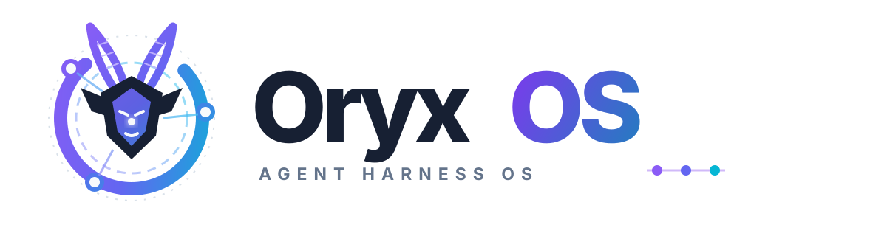
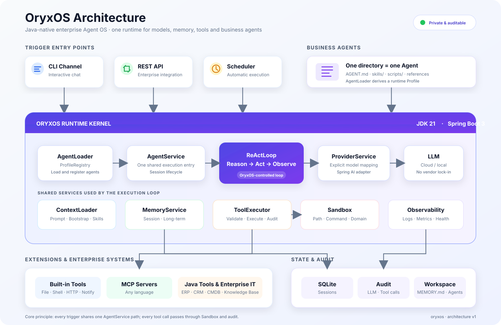

<div align="center">

<p align="center">
  
</p>

# OryxOS

**Java 原生、私有可控、面向企业的 Agent OS**

让企业像部署 Spring Boot 应用一样部署 Agent 底座，统一管理模型、记忆、工具、会话和业务 Agent。

[项目定位](#为什么选择-oryxos) · [核心能力](#核心能力) · [快速开始](#快速开始) · [架构设计](#架构设计) · [路线图](#路线图) · [参与贡献](#参与贡献)

</div>

> [!IMPORTANT]
> OryxOS 当前处于早期开发阶段。JDK 21 + Maven 多模块工程骨架已经建立并可编译打包，Agent 核心能力仍在逐步实现。当前最完整的设计依据请参阅[技术方案](docs/TechnicalSolution.md)。

## 什么是 OryxOS

OryxOS 是一个基于 Java 的开源 Agent 运行和管理底座。它部署在企业自己的服务器、虚拟机或 Kubernetes 集群中，让多个业务 Agent 共享一套基础设施：

- LLM Provider 接入与切换
- ReAct 推理和工具执行
- 会话与长期记忆
- 内置 Tool、MCP 和 Java Tool
- CLI、REST API 和定时任务入口
- 安全白名单、调用审计和可观测能力

业务方不需要为每个 Agent 重写一套后端。定义一个 Agent 目录，配置它使用的模型和工具，再写清楚它要完成的任务，就可以复用整个 OryxOS 底座。

```text
.oryxos/agents/daily-tech-digest/
├── AGENT.md          # 运行配置 + Agent 指令
├── skills/           # 绑定公共 Skill
├── scripts/          # 可选的确定性脚本
└── REFERENCE.md      # 可选参考资料
```

一句话概括：**Agent Runtime 让一个 Agent 跑起来，OryxOS 让一组 Agent 在企业内部被统一运行和管理。**

## 为什么选择 OryxOS

Java 企业已经拥有成熟的服务、数据和运维体系，但现有开源 Agent OS 主要由 Node.js 或 Python 实现。将它们引入 Java 企业通常意味着增加新的技术栈、运维工具和系统集成成本。

OryxOS 选择站在现有 Java/Spring 生态之上：

| 特性 | OryxOS 的选择 |
| --- | --- |
| Java 原生 | JDK 21 + Spring Boot 3.x，直接融入企业 Java 技术栈 |
| 私有部署 | 数据、记忆、凭证和审计记录保留在企业基础设施内 |
| 模型无关 | Provider 抽象支持云端模型、OpenAI 兼容 API 和本地推理服务 |
| 标准扩展 | 通过 MCP 接入任意语言的业务工具，也支持 Java Spring Bean 深度集成 |
| 自主执行 | 自实现 ReAct 循环，完整掌控 Tool 调度、校验、执行和审计 |
| 配置式 Agent | 一个目录定义一个 Agent，业务方聚焦业务指令和工具 |
| 面向治理 | 从核心阶段记录 LLM 和 Tool 调用，为后续 RBAC、SSO 和合规治理建立数据基础 |

OryxOS 的边界也很明确：它负责 Agent 运行时和管理底座，**不做可视化工作流编排平台**。Dify 等编排平台可以运行在 OryxOS 之上，Spring AI 等框架则作为 OryxOS 的底层组件。

## 核心能力

### 1. Provider：统一接入 LLM

基于 Spring AI Alibaba 对接 DeepSeek、通义、Kimi、智谱、OpenAI 兼容服务及本地模型服务。Agent 只声明 Provider 和模型，不感知具体 SDK。

Provider 使用显式名称映射，避免多模型 Bean 自动扫描产生歧义。核心阶段先保证单 Provider 链路稳定，故障转移和多模型路由在后续版本实现。

### 2. ReAct：Agent 执行引擎

OryxOS 自己控制完整的 Reason + Act 循环：

```text
用户消息
  -> 组装上下文
  -> 调用 LLM
  -> 模型决定是否调用 Tool
     -> 否：返回最终响应
     -> 是：校验并执行 Tool -> 记录结果 -> 继续推理
```

Spring AI 只负责协议转换和 Tool Schema 生成，不自动执行 Tool。这样可以避免重复执行，并确保每次调用都经过 Sandbox、权限检查和审计。

### 3. Memory：分层记忆

| 层次 | 用途 | 核心阶段 |
| --- | --- | --- |
| 会话记忆 | 保存当前对话历史和运行上下文 | 实现 |
| 长期记忆 | 保存用户偏好、项目背景和关键事实 | 实现 |
| 情景记忆 | 沉淀任务过程、操作记录和历史决策 | 后续版本 |

核心阶段使用 SQLite 保存 Session，并以 `MEMORY.md` 提供轻量长期记忆。上层通过统一 Memory 接口访问，未来可以替换为 SQLite、Mem0 或向量检索实现。

### 4. Tool：让 Agent 真正执行任务

OryxOS 支持三档扩展方式：

| 方式 | 使用门槛 | 适用场景 |
| --- | --- | --- |
| Agent + 现有 MCP | 零代码 | 组合社区工具，快速创建业务 Agent |
| 自定义 MCP Server | 轻代码 | 使用任意语言接入 ERP、CRM、CMDB 等系统 |
| Java `@Tool` Bean | 深度开发 | 与现有 Spring 服务进行高性能集成 |

核心版本规划提供文件读取、文件写入、目录列表、Shell、HTTP、记忆保存、记忆检索和通知等基础 Tool。所有调用统一进入 `ToolExecutor`，经过参数校验、安全策略和审计记录。

### 5. Web Service：企业系统统一入口

REST API 覆盖六类资源：

- Session 创建、消息发送、历史查询和归档
- Agent 无状态调用
- Profile 查询与重载
- Memory 查询与管理
- Tool 元信息查询
- 健康检查和系统信息

CLI、REST API 和 Scheduler 最终调用同一个 `AgentService`，确保人工对话、系统调用和定时执行具有一致行为。

## 架构设计



目标工程由以下基础模块组成：

| 模块 | 职责 |
| --- | --- |
| `oryxos-core` | 核心模型、ReAct、Prompt、Agent 加载与服务抽象 |
| `oryxos-provider` | LLM Provider 适配和显式映射 |
| `oryxos-memory` | Memory 门面和长期记忆实现 |
| `oryxos-tool` | 内置 Tool、MCP Client、ToolRegistry |
| `oryxos-channel-cli` | CLI 消息渠道 |
| `oryxos-web` | REST API 和统一异常处理 |
| `oryxos-storage` | SQLite Repository 和审计持久化 |
| `oryxos-cli` | Picocli 命令和配置加载 |
| `oryxos-boot` | Spring Boot 入口、自动配置和应用打包 |

模块数量可以随清晰的领域边界演进，但 core 不依赖具体 Provider、存储、Channel 或 Web 实现。

## 快速开始

> [!NOTE]
> Maven 构建和 Spring Boot 启动方式已经可用；工作区、Agent 和完整 API 命令属于后续核心能力的目标用法。

### 环境要求

- JDK 21+
- Maven 3.8.6+
- 一个受支持模型的 API Key，或可访问的本地 OpenAI 兼容模型服务

### 构建与启动

```bash
git clone https://github.com/daiworkspaces/OryxOS.git
cd OryxOS

mvn clean package
java -jar oryxos-boot/target/oryxos-boot-*.jar
```

查看 CLI 版本：

```bash
java -jar oryxos-cli/target/oryxos-cli-*-executable.jar
# OryxOS 0.1.0-SNAPSHOT
```

### 初始化工作区

```bash
oryxos init
oryxos profile create assistant
```

初始化后会生成：

```text
.oryxos/
├── agents/       # 业务 Agent
├── skills/       # 公共 Skill
├── output/       # Agent 产出物
├── memory/       # 长期记忆
├── sessions/     # 会话数据
├── logs/         # 结构化日志
├── AGENTS.md     # 项目级行为说明
├── SOUL.md       # 默认人格
└── USER.md       # 用户偏好
```

### 定义一个 Agent

创建 `.oryxos/agents/weather-assistant/AGENT.md`：

```markdown
---
name: weather-assistant
description: 查询天气并给出出行建议

identity:
  agent_name: Weather Assistant

provider:
  name: deepseek
  model: deepseek-chat
  temperature: 0.2

tools:
  - http_get

settings:
  max_iterations: 10
  max_history_turns: 20
---

你是一名天气与出行助手。
收到天气问题时，先使用 http_get 获取真实天气数据，再根据结果给出简洁、可执行的建议。
```

通过环境变量提供密钥，不要把密钥写入 Agent 文件：

```bash
export DEEPSEEK_API_KEY="your-api-key"
oryxos chat --profile weather-assistant
```

### 通过 API 调用

```bash
# 创建会话
curl -X POST http://localhost:8080/api/v1/sessions \
  -H 'Content-Type: application/json' \
  -d '{"profile":"weather-assistant"}'

# 向会话发送消息
curl -X POST http://localhost:8080/api/v1/sessions/<session-id>/messages \
  -H 'Content-Type: application/json' \
  -d '{"content":"查询北京今天的天气，并告诉我应该穿什么。"}'
```

具体字段和返回结构将在 API 实现落地后，以 OpenAPI 文档为准。

## 安全模型

OryxOS 把安全边界分阶段建设：

- 核心阶段通过文件路径、Shell 命令和 HTTP 域名白名单限制 Tool。
- 文件访问在路径归一化后检查工作区边界，防止目录穿越。
- Shell 参数以 argv 传递，不拼接命令字符串。
- LLM 和 Tool 调用从第一版开始写入审计表，敏感信息需要脱敏。
- API Key 和其他凭证通过环境变量或独立配置注入，不写入 Agent 文件和源码。

应用层白名单不等于真正的执行隔离。运行不可信代码或启用多租户之前，需要引入容器或 MicroVM Sandbox。当前阶段不应将 OryxOS 作为不可信代码执行平台。

## 示例场景

项目首个完整版本计划通过三个端到端场景验收：

1. **每日天气**：定时查询天气，生成穿搭建议并推送通知。
2. **每日科技日报**：按需加载公共 Skill，结合用户长期偏好汇总并推送科技新闻。
3. **每日 GitHub 日报**：通过受控 Tool 执行确定性数据脚本，总结热门项目并推送。

这些场景同时验证 Provider、ReAct、Memory、Tool、Sandbox、Scheduler、通知、Session 和审计链路。

## 路线图

### 核心运行时

- [x] Maven 多模块工程和可执行应用
- [ ] Provider 抽象与至少一个真实 Provider
- [ ] 自实现 ReAct Loop
- [ ] CLI Channel 和 Session 管理
- [ ] 长期 Memory 和记忆 Tool
- [ ] 内置 Tool、MCP Client 和应用层 Sandbox
- [ ] REST API
- [ ] SQLite 持久化与审计写入
- [ ] 多 Agent、Scheduler 和通知推送
- [ ] 三个端到端示例

### 企业治理与生态

- [ ] 企业微信、飞书、钉钉、Slack 等 Channel
- [ ] 向量记忆与情景记忆
- [ ] Provider fallback、路由和成本治理
- [ ] Tool Policy、审批和完整审计查询
- [ ] 容器与 MicroVM Sandbox
- [ ] RBAC、多租户和 SSO
- [ ] Web 管理台
- [ ] 集群部署和高可用

路线图会根据核心链路的验证结果和社区反馈调整。

## 文档

- [行业调研](docs/IndustryResearch.md)：Agent OS 格局、Java 生态机会和 OryxOS 定位
- [需求文档](docs/DemandAnalysis.md)：功能范围、场景、数据模型和验收标准
- [技术方案](docs/TechnicalSolution.md)：架构、关键决策、模块和实施方案
- [AI 编程指南](docs/AiProgrammingGuide.md)：Spec-Kit 与 AI 辅助开发工作流
- [Claude 开发指南](CLAUDE.md)：仓库级开发约束和质量门禁

## 参与贡献

OryxOS 正处于项目早期，欢迎参与架构讨论、文档改进、Provider/Tool/Channel 适配、测试和核心实现。

建议的贡献流程：

1. 提交 Issue 描述问题、使用场景或设计建议。
2. Fork 仓库并从 `main` 创建功能分支。
3. 修改代码和文档，并为新行为补充测试。
4. 确保 `mvn test` 和 `mvn clean package` 通过。
5. 提交 Pull Request，说明变更、验证结果和需要重点 Review 的部分。

涉及公共 API、模块边界、数据模型或安全策略的重大改动，请先通过 Issue 讨论。开发时请遵循 [CLAUDE.md](CLAUDE.md) 中的架构和测试约束。

## 项目状态

OryxOS 当前处于早期开发阶段。现在适合：

- Review 需求和技术方案
- 讨论架构边界与核心接口
- 参与首批模块实现
- 提供企业 Agent 场景和集成需求

现在还不适合用于生产环境。

## License

项目目前尚未提交开源许可证文件。在正式复用、分发或贡献代码前，请等待仓库添加明确的 `LICENSE`。

---

<div align="center">

**Build agents. Keep control.**

</div>
